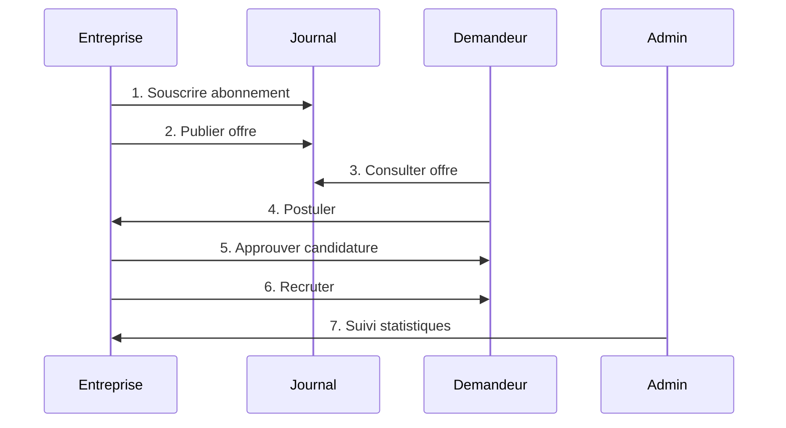

# Rapport Technique du Projet d'Agence de Recrutement

## Résumé Exécutif

Ce document présente une analyse technique complète de l'application de gestion d'agence de recrutement développée en Spring Boot 3.2.0 et JavaFX 21. Le projet implémente une solution desktop hybride permettant la gestion complète du processus de recrutement entre entreprises, demandeurs d'emploi et administrateurs.

---

## 1. Architecture Technique

### 1.1 Architecture Globale

L'application adopte une **architecture en couches classique** avec une particularité : l'intégration de Spring Boot (backend) avec JavaFX (interface desktop).

```
┌─────────────────────────────────────────────────────────────┐
│                    Interface Utilisateur                   │
│                   (JavaFX 21)                         │
├─────────────────────────────────────────────────────────────┤
│                    Contrôleurs                         │
│              (Controllers JavaFX)                      │
├─────────────────────────────────────────────────────────────┤
│                    Services                            │
│                 (Logique Métier)                        │
├─────────────────────────────────────────────────────────────┤
│                   Repositories                         │
│              (Spring Data JPA)                         │
├─────────────────────────────────────────────────────────────┤
│                   Base de Données                      │
│                  (MySQL 8.0+)                          │
└─────────────────────────────────────────────────────────────┘
```

### 1.2 Particularité Architecturelle

#### Intégration Spring Boot + JavaFX
```java
public abstract class JavafxApplication extends Application {
    protected ConfigurableApplicationContext applicationContext;
    
    @Override
    public void init() {
        this.applicationContext = new SpringApplicationBuilder()
            .sources(AgencerecrutementApplication.class)
            .run(getParameters().getRaw().toArray(new String[0]));
    }
}
```

Cette approche permet :
- **Injection de dépendances** dans les contrôleurs JavaFX
- **Gestion transactionnelle** depuis l'interface
- **Accès aux services** Spring directement depuis l'UI

---

## 2. Stack Technique Détaillé

### 2.1 Technologies Principales

| Technologie | Version | Rôle |
|-------------|----------|-------|
| Java | 17+ | Langage principal |
| Spring Boot | 3.2.0 | Framework backend |
| JavaFX | 21 | Interface utilisateur desktop |
| MySQL | 8.0+ | Base de données principale |
| H2 | Runtime | Base de données embarquée |
| Spring Data JPA | 3.2.0 | Persistance des données |
| Lombok | 1.18.x | Réduction code boilerplate |
| Spring Security Crypto | 6.x | Hashage mots de passe |
| Maven | 3.6+ | Gestion dépendances |

### 2.2 Dépendances Clés

```xml
<!-- Spring Boot Starters -->
<dependency>
    <groupId>org.springframework.boot</groupId>
    <artifactId>spring-boot-starter-data-jpa</artifactId>
</dependency>

<!-- JavaFX -->
<dependency>
    <groupId>org.openjfx</groupId>
    <artifactId>javafx-controls</artifactId>
    <version>21</version>
</dependency>

<!-- Base de données -->
<dependency>
    <groupId>com.mysql</groupId>
    <artifactId>mysql-connector-j</artifactId>
</dependency>
```

---

## 3. Modèle de Données

### 3.1 Stratégie d'Héritage

Le projet utilise **l'héritage SINGLE_TABLE** pour la gestion des utilisateurs :

```java
@Entity
@Inheritance(strategy = InheritanceType.SINGLE_TABLE)
@DiscriminatorColumn(name = "type_utilisateur", discriminatorType = DiscriminatorType.STRING)
public abstract class Utilisateur {
    // Champs communs
}
```

**Avantages** :
- Performance optimale (une seule table)
- Simplicité des requêtes
- Gestion centralisée des utilisateurs

### 3.2 Entités Principales

#### Utilisateur (Classe Abstraite)
```java
public abstract class Utilisateur {
    @Id
    private Long idUtilisateur;
    private String login;
    private String motDePasse;
    private Role role; // ADMINISTRATEUR, ENTREPRISE, DEMANDEUR_EMPLOI
    private Boolean actif = true;
}
```

#### Offre d'Emploi
```java
public class Offre {
    private String titre;
    private String competences;
    private Integer experienceRequise;
    private Integer nbPostes;
    private EtatOffre etat; // ACTIVE, DESACTIVEE
    
    @ManyToOne
    private Entreprise entreprise;
    
    @OneToMany(mappedBy = "offre")
    private List<Candidature> candidatures;
}
```

#### Candidature
```java
public class Candidature {
    private LocalDate dateCandidature;
    private StatutCandidature statut; // EN_ATTENTE, APPROUVEE, REJETEE, RECRUTEE
    private boolean notifiee = false;
    
    @ManyToOne
    private DemandeurEmploi demandeur;
    
    @ManyToOne
    private Offre offre;
    
    @ManyToOne
    private Edition edition; // Édition du journal où l'offre a été vue
}
```

### 3.3 Schéma de Base de Données

```sql
-- Table principale avec héritage
CREATE TABLE utilisateurs (
    id_utilisateur BIGINT AUTO_INCREMENT PRIMARY KEY,
    login VARCHAR(255) UNIQUE NOT NULL,
    mot_de_passe VARCHAR(255) NOT NULL,
    type_utilisateur VARCHAR(20) NOT NULL, -- Discriminator
    actif BOOLEAN DEFAULT TRUE,
    -- Champs spécifiques selon le type
    nom VARCHAR(255),
    prenom VARCHAR(255),
    raison_sociale VARCHAR(255),
    experience INT,
    salaire_souhaite DOUBLE
);

-- Table des offres
CREATE TABLE offres (
    id_offre BIGINT AUTO_INCREMENT PRIMARY KEY,
    titre VARCHAR(255) NOT NULL,
    competences TEXT,
    experience_requise INT NOT NULL,
    nb_postes INT NOT NULL,
    etat VARCHAR(20) NOT NULL,
    id_entreprise BIGINT NOT NULL,
    FOREIGN KEY (id_entreprise) REFERENCES utilisateurs(id_utilisateur)
);

-- Table des candidatures
CREATE TABLE candidatures (
    id_candidature BIGINT AUTO_INCREMENT PRIMARY KEY,
    date_candidature DATE NOT NULL,
    statut VARCHAR(20) NOT NULL,
    notifiee BOOLEAN DEFAULT FALSE,
    id_demandeur BIGINT NOT NULL,
    id_offre BIGINT NOT NULL,
    id_edition BIGINT NOT NULL,
    FOREIGN KEY (id_demandeur) REFERENCES utilisateurs(id_utilisateur),
    FOREIGN KEY (id_offre) REFERENCES offres(id_offre),
    FOREIGN KEY (id_edition) REFERENCES editions(id_edition),
    UNIQUE KEY unique_candidature (id_demandeur, id_offre)
);
```

---

## 4. Logique Métier

### 4.1 Règles de Gestion Implémentées

#### 4.1.1 Abonnements
```java
@Transactional
public Abonnement souscrireAbonnement(Long idEntreprise, String codeJournal, LocalDate dateExpiration) {
    // Vérification unicité abonnement actif par journal
    List<Abonnement> abonnementsExistant = abonnementRepository
        .findByEntrepriseIdUtilisateurAndEtat(idEntreprise, ACTIF);
    
    for (Abonnement ab : abonnementsExistant) {
        if (ab.getJournal().getCodeJournal().equals(codeJournal) && ab.estActif()) {
            throw new RuntimeException("Un abonnement actif existe déjà pour ce journal");
        }
    }
}
```

#### 4.1.2 Candidatures
```java
@Transactional
public Candidature postuler(Long idDemandeur, Long idOffre, Long idEdition) {
    // Validation expérience requise
    if (demandeur.getExperience() < offre.getExperienceRequise()) {
        throw new RuntimeException("Expérience insuffisante...");
    }
    
    // Unicité de candidature
    if (candidatureRepository.existsByDemandeurIdUtilisateurAndOffreIdOffre(idDemandeur, idOffre)) {
        throw new RuntimeException("Vous avez déjà postulé à cette offre");
    }
}
```

#### 4.1.3 Recrutements
```java
public int getNbPostesDisponibles() {
    if (recrutements == null || !Hibernate.isInitialized(recrutements)) {
        return nbPostes != null ? nbPostes : 0;
    }
    return nbPostes != null ? nbPostes - recrutements.size() : 0;
}
```

### 4.2 Flux Métier

#### 4.2.1 Cycle de Recrutement


---

## 5. Interface Utilisateur

### 5.1 Architecture JavaFX

#### 5.1.1 Structure des Contrôleurs
```java
@Component
public class MainController {
    // Injection des services Spring
    private final EntrepriseService entrepriseService;
    private final CandidatureService candidatureService;
    
    // Méthodes de création d'interfaces
    private Pane createEntreprisePane() { /* ... */ }
    private Pane createDemandeurPane() { /* ... */ }
    private Pane createAdminPane() { /* ... */ }
}
```

#### 5.1.2 Gestion des Onglets
L'interface utilise un système d'onglets dynamiques selon le rôle :

- **Administrateur** : Gestion utilisateurs, journaux, statistiques
- **Entreprise** : Offres, abonnements, candidatures, recrutements
- **Demandeur** : Offres disponibles, mes candidatures, journaux

### 5.2 Composants UI Avancés

#### 5.2.1 TableView Personnalisées
```java
// Coloration dynamique des statuts
TableColumn<Candidature, String> statutCol = new TableColumn<>("Statut");
statutCol.setCellFactory(param -> new TableCell<>() {
    @Override
    protected void updateItem(String item, boolean empty) {
        super.updateItem(item, empty);
        if (!empty && item != null) {
            setText(item);
            Candidature.StatutCandidature statut = getTableView().getItems().get(getIndex()).getStatut();
            setStyle(getStatutStyle(statut));
        }
    }
});
```

#### 5.2.2 Système de Notifications
```java
// Détection des nouvelles approbations
List<Candidature> nouvellesApprouvees = candidatures.stream()
    .filter(c -> c.getStatut() == APPROUVEE)
    .filter(c -> !c.isNotifiee())
    .collect(Collectors.toList());

if (!nouvellesApprouvees.isEmpty()) {
    HBox notificationBox = new HBox(10);
    notificationBox.setStyle("-fx-background-color: #d4edda;");
    // Affichage notification
}
```

---

## 6. Sécurité

### 6.1 Gestion des Mots de Passe

#### 6.1.1 Hashage BCrypt
```java
@Service
public class AuthentificationService {
    private final BCryptPasswordEncoder passwordEncoder = new BCryptPasswordEncoder();
    
    public String hasherMotDePasse(String motDePasse) {
        return passwordEncoder.encode(motDePasse);
    }
    
    public boolean verifierMotDePasse(String motDePasse, String hash) {
        return passwordEncoder.matches(motDePasse, hash);
    }
}
```

#### 6.1.2 Vulnérabilité Identifiée
⚠️ **Problème critique** : Support temporaire mots de passe en clair
```java
// CODE DANGEREUX - À CORRIGER
if (!motDePasse.equals(utilisateur.getMotDePasse()) && 
    !passwordEncoder.matches(motDePasse, utilisateur.getMotDePasse())) {
    throw new RuntimeException("Login ou mot de passe incorrect");
}
```

### 6.2 Contrôle d'Accès

#### 6.2.1 Validation par Rôle
```java
// Dans les contrôleurs
if (utilisateurConnecte.getRole() != Utilisateur.Role.DEMANDEUR_EMPLOI) {
    throw new RuntimeException("Accès non autorisé");
}
```

#### 6.2.2 Isolation des Données
```java
// Un demandeur ne voit que ses candidatures
List<Candidature> candidatures = candidatureService
    .getCandidaturesByDemandeur(demandeur.getIdUtilisateur());
```

---

## 7. Performance et Optimisation

### 7.1 Stratégies de Performance

#### 7.1.1 Requêtes Optimisées
```java
// Éviter les N+1 queries
public List<Candidature> getCandidaturesWithRelations(Long idDemandeur) {
    return candidatureRepository.findByDemandeurIdUtilisateurWithRelations(idDemandeur);
}
```

#### 7.1.2 Lazy Loading Géré
```java
public int getNbPostesDisponibles() {
    if (recrutements == null || !Hibernate.isInitialized(recrutements)) {
        return nbPostes != null ? nbPostes : 0;
    }
    return nbPostes != null ? nbPostes - recrutements.size() : 0;
}
```

### 7.2 Gestion des Fichiers

#### 7.2.1 Upload de Documents
```java
public Document uploadDocument(MultipartFile file, DemandeurEmploi demandeur, String typeDocument) {
    // Validation taille et type
    if (file.getSize() > maxFileSize) {
        throw new IllegalArgumentException("Fichier trop volumineux");
    }
    
    // Génération nom unique
    String uniqueFilename = UUID.randomUUID().toString() + extension;
    
    // Stockage physique et métadonnées
    Files.copy(file.getInputStream(), filePath);
    document.setCheminStockage(filePath.toString());
}
```

---

## 8. Tests et Qualité

### 8.1 Couverture de Tests Actuelle

| Type de Test | Couverture | Statut |
|---------------|-------------|----------|
| Tests Unitaires | 0% | À implémenter |
| Tests d'Intégration | 0% | À implémenter |
| Tests UI | 0% | Non applicable |

### 8.2 Recommandations Tests

#### 8.2.1 Tests Unitaires Critiques
```java
@Test
void shouldHashPasswordCorrectly() {
    String password = "password123";
    String hash = authentificationService.hasherMotDePasse(password);
    
    assertThat(authentificationService.verifierMotDePasse(password, hash)).isTrue();
    assertThat(authentificationService.verifierMotDePasse("wrong", hash)).isFalse();
}

@Test
void shouldRejectDuplicateCandidature() {
    // Test unicité candidature
    assertThatThrownBy(() -> candidatureService.postuler(idDemandeur, idOffre, idEdition))
        .isInstanceOf(RuntimeException.class)
        .hasMessage("Vous avez déjà postulé à cette offre");
}
```

---

## 9. Déploiement et Configuration

### 9.1 Configuration Production

#### 9.1.1 application.properties
```properties
# Base de données
spring.datasource.url=jdbc:mysql://prod-server:3306/agence_recrutement
spring.datasource.username=${DB_USERNAME}
spring.datasource.password=${DB_PASSWORD}

# JPA
spring.jpa.hibernate.ddl-auto=validate
spring.jpa.show-sql=false

# Fichiers
app.upload.dir=/var/uploads/agence-recrutement
app.max.file.size=10485760
```

#### 9.1.2 Configuration Maven
```xml
<build>
    <plugins>
        <plugin>
            <groupId>org.springframework.boot</groupId>
            <artifactId>spring-boot-maven-plugin</artifactId>
            <configuration>
                <mainClass>com.example.agencerecrutement.AgenceRecrutementApp</mainClass>
            </configuration>
        </plugin>
    </plugins>
</build>
```

### 9.2 Processus de Build

```bash
# Compilation
mvn clean compile

# Tests
mvn test

# Package
mvn package

# Exécution
java -jar target/agencerecrutement-0.0.1-SNAPSHOT.jar
```

---

## 10. Analyse de Risques et Recommandations

### 10.1 Risques Identifiés

#### 10.1.1 Critiques 🔴
- **Sécurité mots de passe** : Support texte clair en production
- **Absence de tests** : Pas de validation automatique
- **Logging SQL en production** : Performance et sécurité

#### 10.1.2 Moyens 🟡
- **UI programmatique** : Maintenance difficile
- **Pas de FXML** : Séparation UI/logique faible
- **Gestion erreurs** : Limitée

#### 10.1.3 Faibles 🟢
- **Architecture** : Bien structurée
- **Performance** : Optimisations en place
- **Fonctionnalités** : Complètes et cohérentes

### 10.2 Plan d'Action Prioritaire

#### Phase 1 (Urgent - 1 semaine)
1. **Corriger sécurité mots de passe**
2. **Désactiver logs SQL en production**
3. **Implémenter tests critiques**

#### Phase 2 (Important - 2 semaines)
1. **Refactoriser UI vers FXML**
2. **Améliorer gestion erreurs**
3. **Ajouter logging structuré**

#### Phase 3 (Amélioration - 1 mois)
1. **Tests complets**
2. **Documentation API**
3. **Optimisations performance**

---

## 11. Conclusion

L'application de gestion d'agence de recrutement présente une **architecture technique solide** avec une bonne séparation des responsabilités et une implémentation complète des fonctionnalités métier. L'intégration Spring Boot + JavaFX est bien réalisée et permet une interface desktop riche avec accès à toute la puissance de l'écosystème Spring.

Les points forts incluent :
- Architecture en couches claire
- Gestion complète du cycle de recrutement
- Interface utilisateur riche et réactive
- Optimisations de performance pertinentes

Les améliorations prioritaires doivent se concentrer sur :
- **Sécurité** (correction vulnérabilité mots de passe)
- **Tests** (implémentation suite de tests)
- **Maintenabilité** (refactorisation UI)

Avec ces corrections, le projet atteindra un niveau de qualité production-ready tout en conservant ses excellentes fondations architecturales.

---

**Version du document** : 1.0  
**Date** : Janvier 2024  
**Auteurs** : Hiba Zouitina, Imane Taleb, Saïda Stifi, Chouaib Bouslamti
